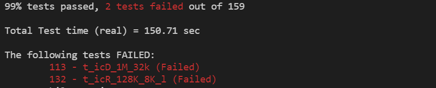
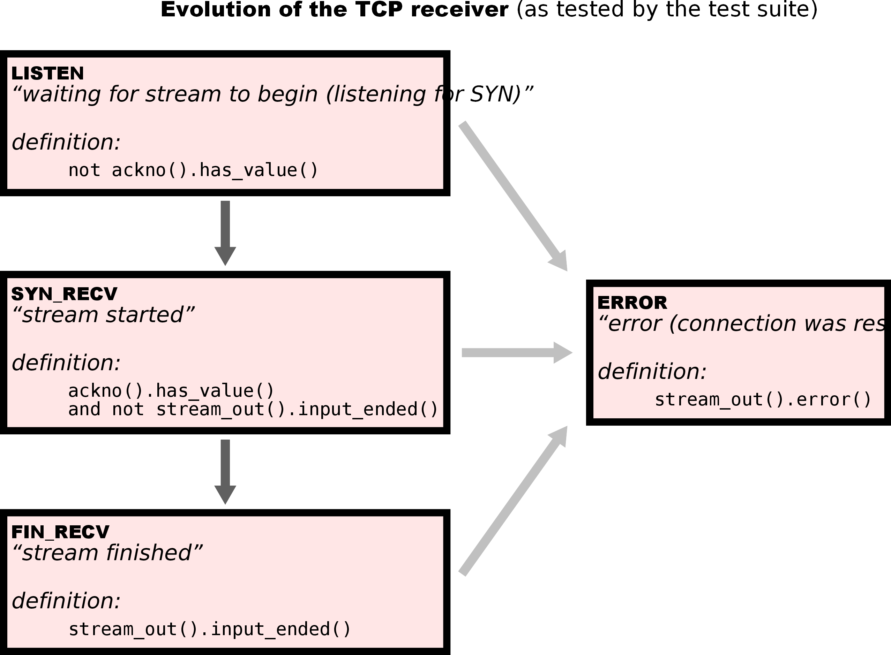
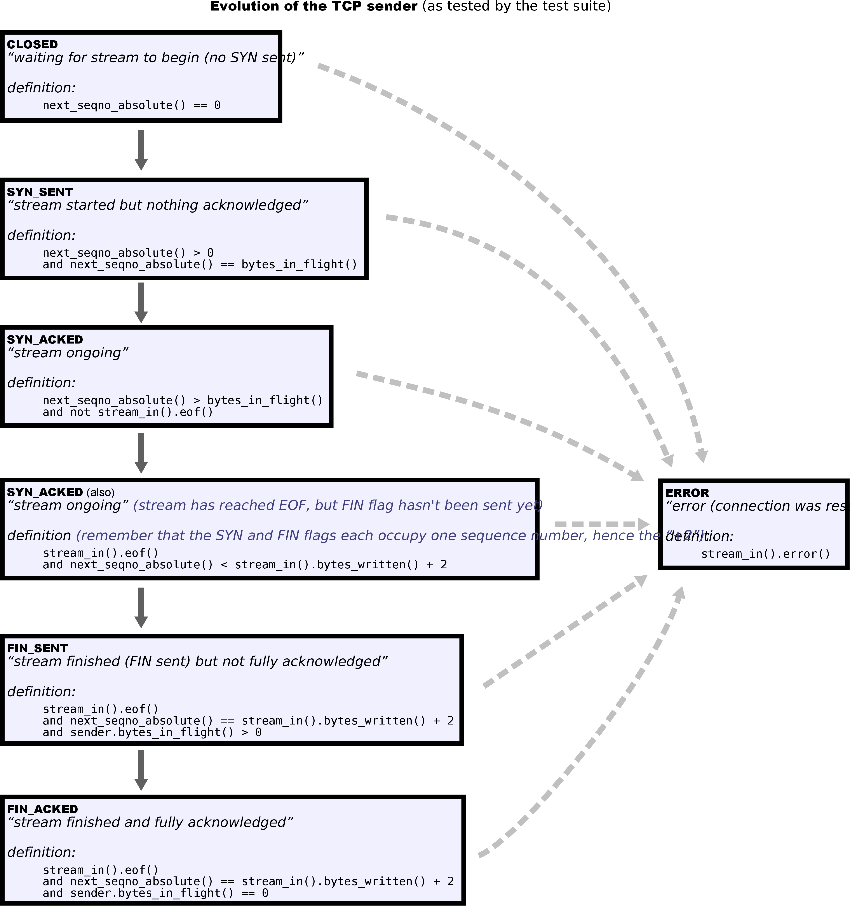

# CS144: Introduction to Computer Networking
### lab assignments
* lab0: networking warmup
* lab1: stitching substrings into a byte stream
* lab2: the TCP receiver
* lab3: the TCP sender
* lab4: the TCP connection
* lab5: the network interface
* lab6: the IP router
  
### remaining bug
* in lab4 test, sometimes few test case (vary from 2 to 5) fail.

### reference
* **TCP receiver**

* **TCP sender**

* **TCP FSM**

  